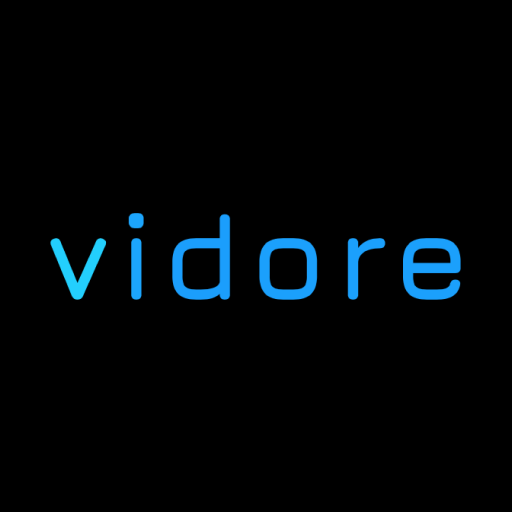

<div align="center">

</div>
<h1 align="center">Vidore</h1>
<div align="center">
A Modern Video Discovery & Streaming Site. <br />

</div>

---

## Built Using

- Next.js
- React
- TailwindCSS
- TMBD API

---

## Develop Locally

1. Clone this repository

```bash
# cloning the git repository into the `vidore` folder
git clone https://github.com/jackjona/vidore vidore

# install project dependencies
cd vidore
npm install
# OR
yarn install
```

2. Input your [TMBD API](https://developers.themoviedb.org/3/getting-started/introduction) key and rename `.env.local.example` to `env.local`

3. Run the development server:

```bash
npm run dev
# OR
yarn dev
```

4. Open [http://localhost:3000](http://localhost:3000) with your browser to see the result.

---

## License

Licensed under the [GNU AGPLv3](https://www.gnu.org/licenses/agpl-3.0.en.html). Please see [LICENSE.txt](./LICENSE.txt) for more information.
